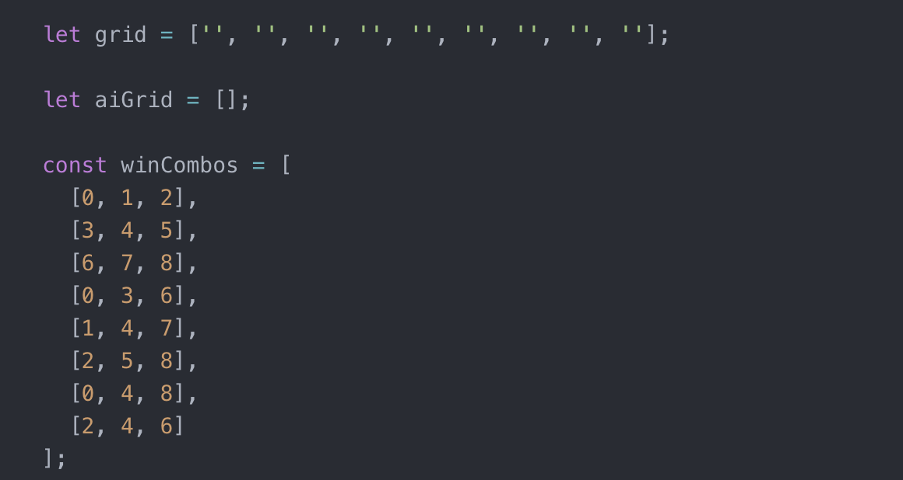

# Tic - Tac - Toe

Classic game with an unbeatable, semi intelligent AI.

##Brief

- Render a game board in the browser
- Switch turns between X and O (or whichever markers you select); your game should prevent users from playing a turn into a square that is already occupied
- Visually display which side won if a player gets three in a row or show a draw/"cat’s game" if neither wins
- Include separate HTML / CSS / JavaScript files
- Stick with KISS (Keep It Simple Stupid) and DRY (Don't Repeat Yourself) principles
- Use Javascript with jQuery for DOM manipulation
- Deploy your game online, where the rest of the world can access it
- Use semantic markup for HTML and CSS (adhere to best practices)

**and finally...**

**have some fun with it!!**

##Tech Used

- HTML
- CSS
- Vanilla JavaScript
- jQuery

##Link to the Deployed Game

https://jaytees.github.io/tic-tac-toe/

##Experience and Process

- This was my first project at General Assembly and therefore my first website and it really was such an exciting and fulfilling experience. Every feature I got working came with a huge sense of achievement.
- Being my first project I had really low expectations, so I broke this process down into the smallest little blocks imaginable, wrote lots of pseudo code and worked through that list until the time ran out. Learning a valuable lesson about how to approach a problem in the process.
- Just to give some perspective these blocks began with render a the board to the screen, then can I attach a click handler to the squares that console logs the div id.
- And somewhere along the way I just hit a flow and started ticking chunks off my list daily and adding more functionality onto the end.
- This project definitely gave oxygen to fire that was already catching.

##Wins

- **AI** - My proudest achievement on this project. The AI will look to block any possible user wins and look for a win. This wasn't on my radar when I first started this project but soon became the goal. Once I had developed the code to check if a user had won, I realised I could use the same logic to integrate a semi-intelligent AI. So again, I broke the process down into the smallest blocks as follows;
  - AI placing counters on random grid squares.
  - Use the same logic to check if a user has won, to check if a user is about to win.
  - Use that same logic to check if there is a winning combination available and play that square.
- **Seperation of Concerns** - The separation of concern between UI and game logic was a core goal of mine from the offset. As I mentioned I had low expectations going into this so my goal was to adhere to core principles of good, clean code.

##Challenges

- **Checking for a Win** - I found it difficult to work out how to articulate the winning combinations in a way that could be checked against the current board status. I knew this could be achieved with an array storing the current board status and a long if statement comparing this to the possible winning combinations. But knew this wasn't the DRYest or simplest way. After some trial and error and research I came across 2D arrays. Which would allow me to store each winning combo, loop through them and evaluate the current board status with the same conditional.

##Code

**Win Logic**

**AI**

- Checking for blocks or wins

**Winning Counters**

- Animate the winning counters

##Screenshots

**Welcome Screen Image**

**Game Screen Image**

##Current Bugs

- You can currently register moves by continuously clicking free squares and forcing a draw.
